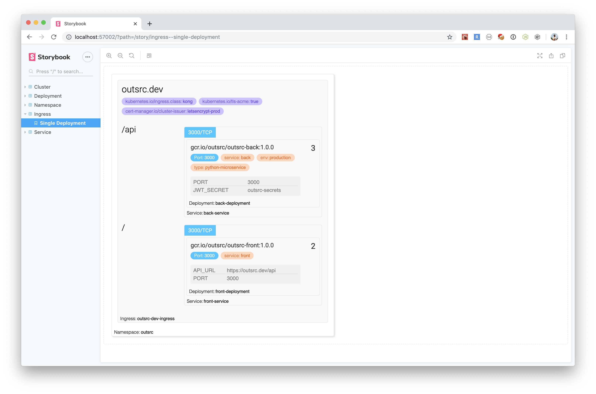

# react-k8s

This is a Work in Progress attempt to make a 
simplified visualization/management for Kubernetes
applications. 

The use case is: Deploy/Manage Application on 
Kubernetes   

- You create a React application: NextJS or CRA
- Add `react-k8s` as a dependency
- Model your deployment using provided components
- Connect your Kubernetes cluster and let the App
synchronize your cluster and manage it directly from
the UI your just built.

### Contribute

If you are interested in this project please contribute. 
We accept PR, suggestions, solutions, perspective or a coffee.

To run locally:

```
$ yarn install

$ yarn storybook
``` 


